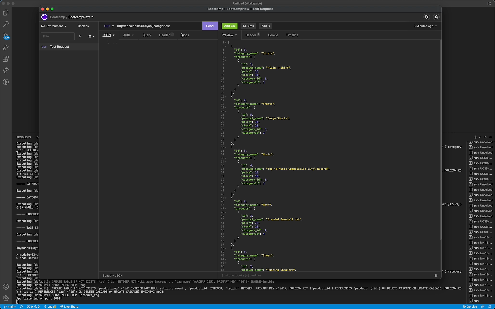
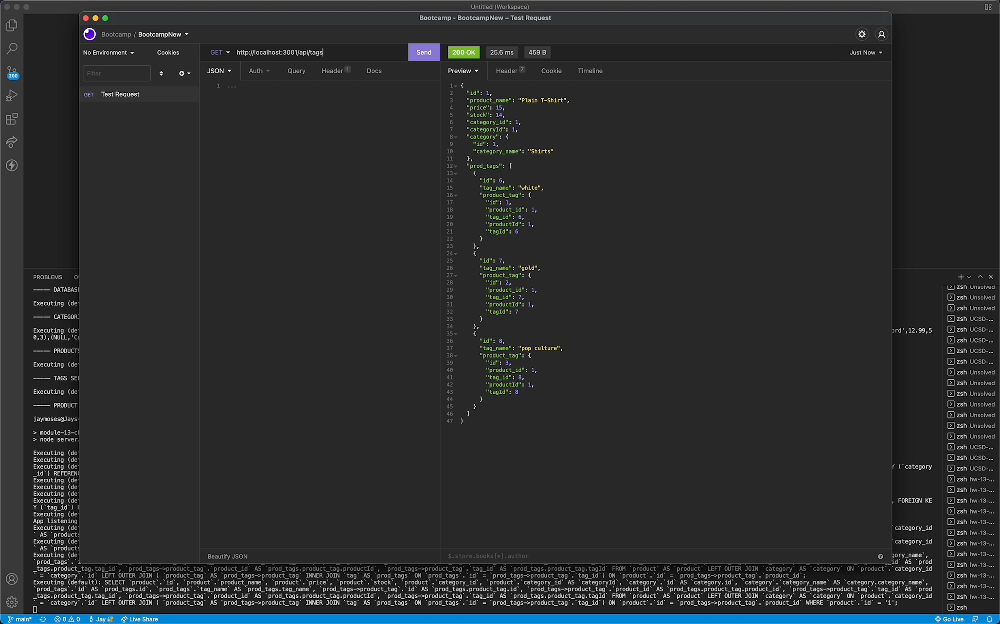
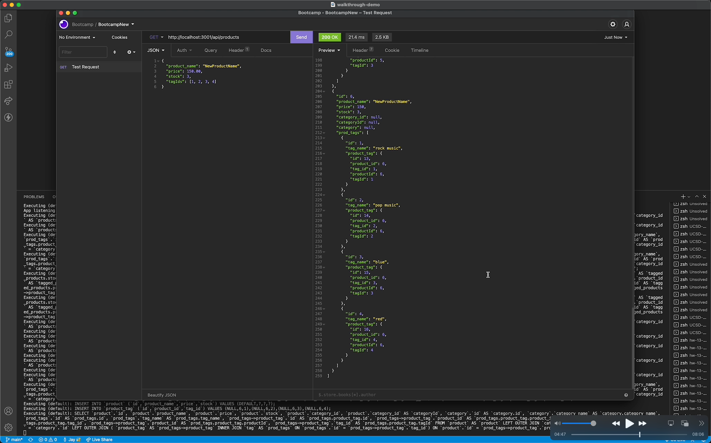
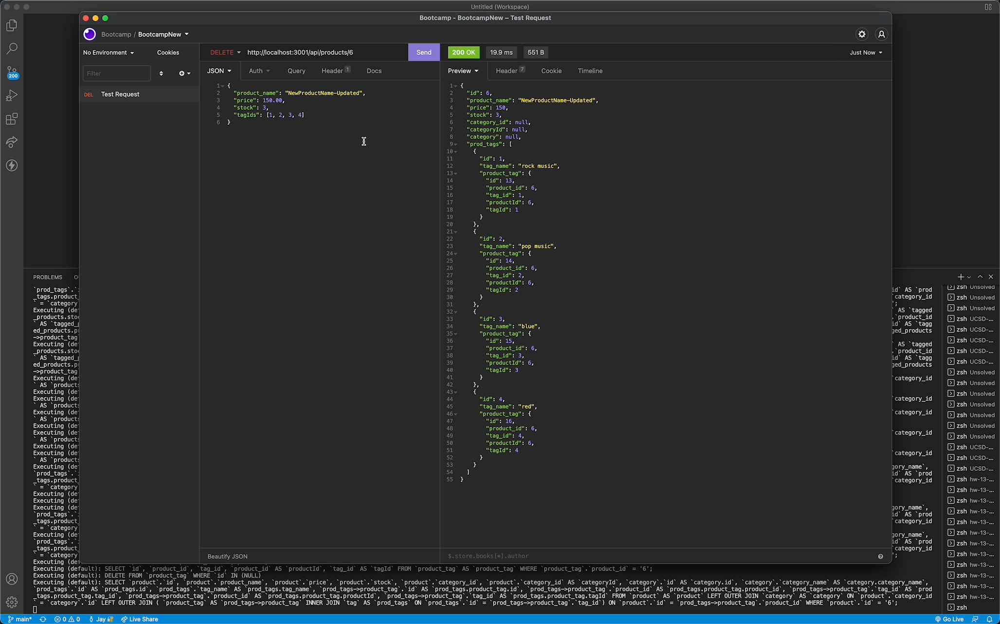
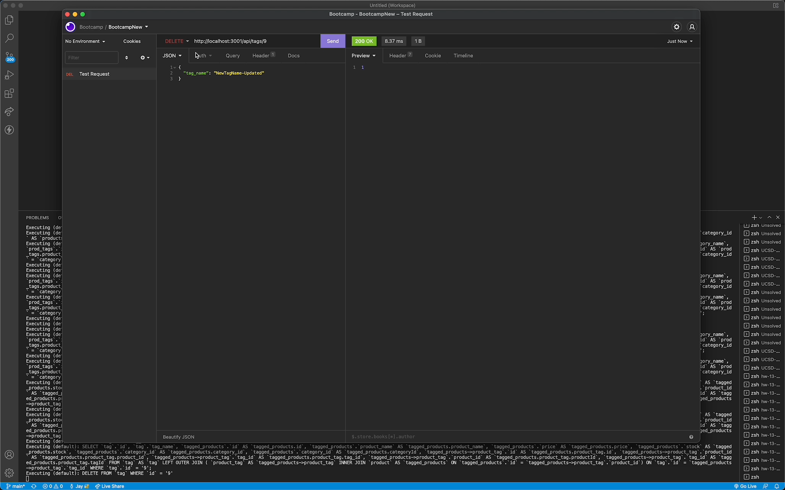

# Homework 13: E-Commerce Back End

## Description

I further developed code to create the e-commerce back end for a site, which allows the user to:
* Utilize GET routes to view all categories, products, and tags, and to view specific categories, products, and tags.
* Utilize POST routes to update specific categories, products, and tags.
* Utilize DELETE routes to delete specific categories, products, and tags.

## Screenshots of the application

## Application walkthrough video demo

A video demonstrating the functionality of this application can be found at the URL below.

URL of walkthrough video demo: https://drive.google.com/file/d/1AyOMqsmuYQW7FD5abH8GOHpN7rebVVki/view?usp=sharing

## Technologies used

This application utilizes these technologies:

* Node.js
* The [MySQL 2 NPM package](https://www.npmjs.com/package/mysql2)
* The [Express.js NPM package]()
* The [Sequelize NPM package](https://www.npmjs.com/package/sequelize)
* The [dotenv NPM package](https://www.npmjs.com/package/dotenv)
* JavaScript

## Contact information

* Website: https://jaymoses01.github.io/hw-08-updated-portfolio-page/
* Email: JayRMoses@gmail.com

## MIT license

Permission is hereby granted, free of charge, to any person obtaining a copy
of this software and associated documentation files (the "Software"), to deal
in the Software without restriction, including without limitation the rights
to use, copy, modify, merge, publish, distribute, sublicense, and/or sell
copies of the Software, and to permit persons to whom the Software is
furnished to do so, subject to the following conditions:

The above copyright notice and this permission notice shall be included in all
copies or substantial portions of the Software.

THE SOFTWARE IS PROVIDED "AS IS", WITHOUT WARRANTY OF ANY KIND, EXPRESS OR
IMPLIED, INCLUDING BUT NOT LIMITED TO THE WARRANTIES OF MERCHANTABILITY,
FITNESS FOR A PARTICULAR PURPOSE AND NONINFRINGEMENT. IN NO EVENT SHALL THE
AUTHORS OR COPYRIGHT HOLDERS BE LIABLE FOR ANY CLAIM, DAMAGES OR OTHER
LIABILITY, WHETHER IN AN ACTION OF CONTRACT, TORT OR OTHERWISE, ARISING FROM,
OUT OF OR IN CONNECTION WITH THE SOFTWARE OR THE USE OR OTHER DEALINGS IN THE
SOFTWARE.
